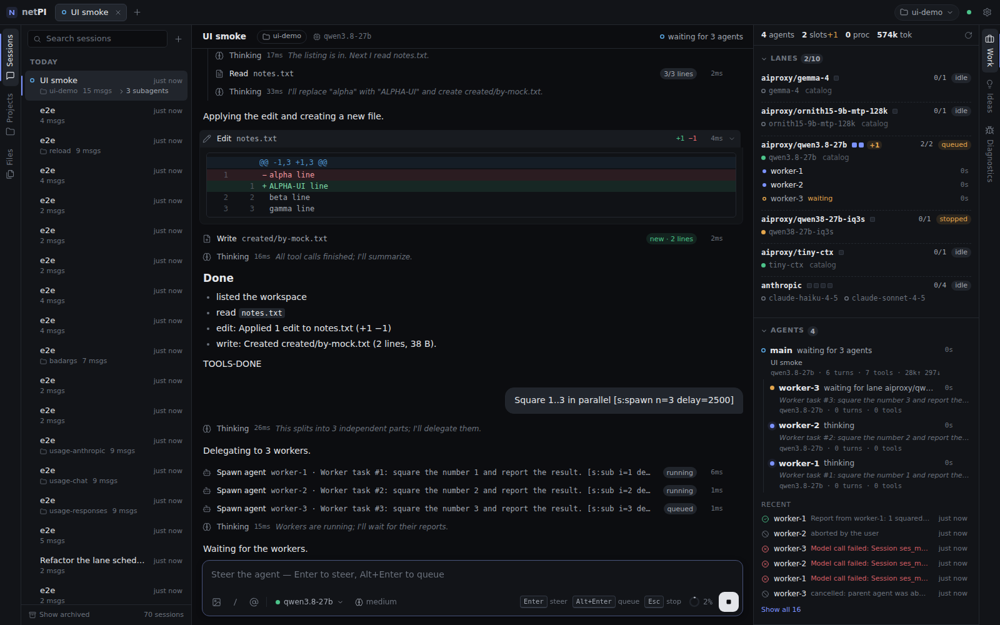

# netPI

A fast, minimal LLM agent harness in the spirit of [pi](https://pi.dev): a small .NET 10 core where **everything is a
runtime-reloadable plugin** — model providers, tools, the agent loop, agents, compaction, retries, the panel tabs —
and a Svelte UI shown in a WebView2 window. The desktop app starts its own server; the same server also runs
headless for any browser.



## Highlights

- **Sessions first, projects switchable.** A session is the unit of work; a project is just a name + folder. Switch
  the project mid-session and the agent gets a short notice with its new working directory. Open sessions are tabs.
- **Agents.** An agent is a model you set up with a number of instances and a note on when to use it ("free: research
  and reading code", "costs money: only for hard problems"). Chats run on agents (the composer's agent picker), and an
  agent that delegates picks one by its note and price for each subagent. Two agents on your local `qwen3.8-27b`
  (AiProxy reports `concurrency: 2`) share its two slots. An agent is active only while its model is loaded: NetPI
  never loads a model (that could evict what another agent runs), so when you switch models in AiSwitcher the agents
  follow. Runs queue when all instances are busy; an orchestrator that waits for its workers **yields** its instance to
  them and resumes with only their final reports. Switch an agent off in its dialog or in the Work tab.
- **A budget for paid models.** Every model call is recorded with its cost (OpenRouter reports it; otherwise tokens ×
  price). Set a monthly budget: agents see it, each chat shows what it cost, and when it is spent paid calls stop, or
  ask you first.
- **Agents manage agents.** `agent_spawn`, `agent_wait`, `agent_send`, `agent_list`, `agent_result`, `agent_cancel`
  (plus `agent_choices` from the agents plugin); subagents get their own (viewable, steerable) sessions and report back
  automatically. The agent that starts one chooses its tools, so a limited orchestrator can dispatch agents that can do
  more.
- **Profiles.** A profile is the opening of the system prompt ("You are a system administrator…") and the tools a chat
  gets, switched on and off with checkboxes. Give one to a project and its new chats start with it; switch it in a chat
  for free before the first message.
- **Steering and queueing.** While an agent runs, *Enter* steers it (delivered after the current tool call) and
  *Alt+Enter* queues a follow-up; *Esc* stops.
- **Goals.** `/goal <what must be true>` keeps the agent working: after every run it is started again until it marks
  the goal complete (`goal_update`) or needs you; stopping, a failure, runs without progress and limits pause it.
- **Tools as plugins:** `read`, `write`, `edit` (multi-edit, replace-all), `grep`, `find`, `ls` — all CRLF/LF
  agnostic, preserving each file's line endings and BOM — plus `bash` (Git Bash on Windows), `pwsh` and background
  processes; `web_fetch` (pages as Markdown), `web_search` (SearXNG or Brave), `screenshot` (headless Edge/Chrome,
  or the NetPI window), `todo_write` (a checklist shown above the composer), `show_image` (the agent shows you an
  image) and `ssh_*` (scripts and files on the hosts in `~/.ssh/config`, sent through stdin, so nothing needs
  quoting). Replace any tool by registering one with the same name. Each chat can switch tools off (the tools button
  next to the model). File links in the chat open with the operating system.
- **Providers:** AiProxy / any OpenAI-compatible server (Responses API by default, Chat Completions per model),
  Anthropic Claude (thinking, prompt caching) and OpenRouter (hundreds of hosted models, unified reasoning with replayed
  `reasoning_details`).
- **Robustness plugins:** auto-compaction, auto-nudge (continues agents that stall or get cut off mid-thinking),
  retry on lost connections/stalled streams, repair of tool calls a model wrote as text (`<tool_call>…`).
- **Context that never rewrites history:** a bare system prompt that plugins and tools contribute to, rendered once per
  session; the working directory, project and instruction files (global `~/.netpi/AGENTS.md` + every
  `AGENTS.md`/`CLAUDE.md` from the file system root down to the project) arrive as notices when they apply or change,
  so the backend's prompt cache survives a project switch or an edited AGENTS.md. Tools from a plugin loaded mid-session
  are announced the same way.
- **Skills** ([Agent Skills](https://agentskills.io) standard): folders with a `SKILL.md` in the project
  (`.agents/skills`, `.netpi/skills`) or globally (`~/.agents/skills`, `~/.netpi/skills`). Agents get the catalog as a
  notice and load a skill with the `skill` tool when a task matches; `/skill:name` loads one for your message.
- **Ideas backlog:** agents and you park research, plans and requirements in `ideas.json` in the project folder
  (tools `idea_*` + the Ideas tab); "send to chat" when it's time to implement.
- **UI:** left and right panels with vertical, pluggable tabs (Sessions, Projects, Files | Work, Ideas,
  Diagnostics), collapsible thinking/tool blocks, diffs, live shell output, pruned chat history with "load earlier",
  slash commands and `@` file mentions. Window size and position are remembered.
- **SQLite** storage (the OS's own SQLite: no native packages to ship).

## Quick start (Windows)

Requirements: **.NET 10 SDK**, the **WebView2 runtime** (built into Windows 11), **Git for Windows** (for the `bash`
tool). Optional: PowerShell 7 (`pwsh` tool), Node.js 22 (only to change the UI — built bundles are committed).

```powershell
cd C:\AI\NetPI
.\build.ps1 -Run          # builds into artifacts\app and starts artifacts\app\NetPI.exe
```

From cmd: `build -Run` (`build.cmd` runs `build.ps1` with the same options; `build /?` lists them).

On first start `%USERPROFILE%\.netpi\settings.json` is created: AiProxy at `http://127.0.0.1:8090` (Responses
transport) and `aiproxy/qwen3.8-27b` as the default model. For Claude set `providers.anthropic.apiKey` (or the
`ANTHROPIC_API_KEY` environment variable), for OpenRouter `providers.openrouter.apiKey` (or `OPENROUTER_API_KEY`).
All keys: [docs/SETTINGS.md](docs/SETTINGS.md).

Headless: `artifacts\app\netpi-server.exe --open` (prints and opens a tokenized URL). Linux/macOS: `./build.sh`, then
`artifacts/app/netpi-server --open`.

## Using it

| | |
|---|---|
| *Enter* / *Shift+Enter* | send / newline |
| *Enter* while running · *Alt+Enter* · *Esc* | steer · queue a follow-up · stop |
| `/` | commands: `/new /rename /agent /project /compact /idea /reload /settings /help /abort` |
| `@` | mention a file of the session's workspace |
| *Ctrl+T*, *Ctrl+W*, *Ctrl+Tab*, *Ctrl+1…9* | new, close, cycle, pick session tabs |
| *Ctrl+B* / *Ctrl+Alt+B* | toggle left / right panel · *Ctrl+K* command palette |

The agent, reasoning-effort and tools pickers, the chat's cost and the context meter sit in the composer. Settings
(*Ctrl+,*) has real controls for the host's and every plugin's settings, the agents and the budget. The **Work** tab shows
the agents (state, busy/instances, queues, an on/off switch), runs (active and recent), processes (with live output and
kill) and this month's spend; **Diagnostics** shows
plugins (reload/enable/disable), tools, RPC methods, the live event bus, logs and the exact system prompt.

## Architecture

```
NetPI.exe (WinForms + WebView2) ─┐          ┌─ plugins/ (collectible load contexts, hot reload)
netpi-server (headless) ─────────┴─ NetPI.Host ─┤   NetPI.Runtime        agent loop, steering/queue, subagents, yield
   Kestrel 127.0.0.1 + WebSocket (token auth)   │   NetPI.Agents        agents, queueing, the cost ledger, the budget
   plugin manager · event bus · service/RPC/    │   NetPI.Context      system prompt (frozen per session), project notices
                                                │   NetPI.Profiles     a chat's opening instructions and tools, a default per project
   tool/UI registries · SQLite · settings ·     │   NetPI.AgentsMd     AGENTS.md / CLAUDE.md, announced as notices
                                                │   NetPI.Skills       Agent Skills: the catalog notice, the skill tool, /skill:name
   session store · model catalog                │   NetPI.Providers.*  AiProxy (OpenAI-compatible), Anthropic, OpenRouter
                                                │   NetPI.Tools.*      files, shell, agents, web, media, ssh · NetPI.Todo · NetPI.Goal
NetPI.Abstractions: the contracts plugins use   │   NetPI.Compaction · NetPI.Nudge · NetPI.Retry · NetPI.ToolRepair
web/ (Svelte 5): the UI + plugin tab kit        │   NetPI.Ideas · NetPI.Work · NetPI.Diagnostics
                                                └─ ~/.netpi/plugins/ (your own)
```

Data: `~/.netpi/` — `settings.json`, `netpi.db` (sessions, messages, projects, agents, usage), `AGENTS.md`, `skills/`,
`logs/`, `webview/`, `window.json`, `workspace/` (cwd of sessions without a project).

## Develop

```powershell
dotnet build plugins\NetPI.Nudge     # while NetPI runs: the plugin hot-reloads
.\build.ps1                          # while NetPI runs too: plugins hot-reload, a new host starts with the next NetPI
.\build.ps1 -NextStart               # while NetPI runs: nothing changes in it, its next start runs the new build
npm run build:plugins                # plugin tab UIs → tabs reload
npm run dev                          # UI dev server against a running NetPI (see docs/UI.md)
.\build.ps1 -Test                    # unit suites (NuGet-free console runners)
```

| doc | |
|---|---|
| [docs/PLUGINS.md](docs/PLUGINS.md) | writing plugins (tools, providers, hooks, prompt sections, tabs) |
| [docs/PROTOCOL.md](docs/PROTOCOL.md) | UI ⇄ server protocol, RPC methods, events |
| [docs/TOOLS.md](docs/TOOLS.md) | built-in tools and their UI details |
| [docs/SETTINGS.md](docs/SETTINGS.md) | every setting |
| [docs/UI.md](docs/UI.md) | the Svelte app and the plugin tab kit |
| [docs/TESTING.md](docs/TESTING.md) | unit suites, the mock model server, the end-to-end suite |
| [docs/PLUGIN-WORK.md](docs/PLUGIN-WORK.md), [IDEAS](docs/PLUGIN-IDEAS.md), [DIAGNOSTICS](docs/PLUGIN-DIAGNOSTICS.md) | the Work, Ideas and Diagnostics plugins and tabs |
| [docs/PLUGIN-SKILLS.md](docs/PLUGIN-SKILLS.md) | skills: where they are found, what agents get, `/skill:name` |
| [docs/AIPROXY-AGENT-GUIDE.md](docs/AIPROXY-AGENT-GUIDE.md) | the local AiProxy server |
| [docs/HANDOFF.md](docs/HANDOFF.md), [docs/STATUS.md](docs/STATUS.md) | current state, decisions and next steps; what is verified, known limitations |
| [docs/archive/](docs/archive/) | records of completed plans |
